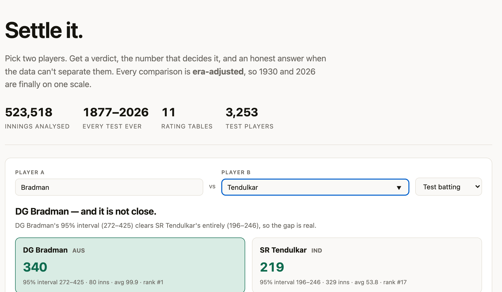
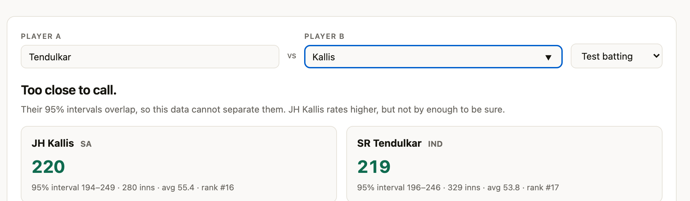

# Howzat

**Settle any cricket argument with an era-adjusted number and a confidence interval. When the data cannot decide, it says so.**

### → [**Try it live**](https://polestarrr.github.io/howzat/) ←

[](https://github.com/POLESTARRR/howzat/actions/workflows/ci.yml)




---

## The problem

Cricket still ranks players by **batting average**, a statistic invented in the
1800s that adjusts for nothing. Not the era, the opposition, the conditions or
the format. That is why Bradman against Tendulkar has never been settleable, and
why you cannot compare a bowler to a batter at all.

Baseball fixed this decades ago with `wRC+`, where 100 is always league average
so 1996 and 2026 sit on one scale. **Cricket has no equivalent.** This builds one.

## What it does

| | |
|---|---|
| **CRI+** | Era-adjusted batting. 100 = an average batter of the same era *and format* |
| **BOWL+** | Era-adjusted bowling, decomposed into wicket-taking and economy |
| **ALL+** | All-rounders, on a harmonic mean so a weak half cannot be hidden |
| **Peak** | Best sustained 4-year window, not a career average |
| **RAR** | Runs above replacement. The one place bat and ball share a unit |
| **Rule effects** | What each Law change did to scoring, with 95% intervals |

Across **six formats** covering Test, ODI and T20I for both men and women, built
from **523,518 innings** between 1877 and 2026.

## It says I don't know

This is the part most stats sites get wrong. Every rating carries a 95% interval.
A winner is declared only when the two intervals do not overlap.



This data cannot separate Tendulkar and Kallis, so it says so instead of inventing
a ranking. **An overlap is a result.**

## The panel

`howzat ask` runs four agents over the ratings. A Statistician gathers evidence.
A Historian supplies era context. A **Skeptic attacks the emerging consensus**.
A Judge weighs it all and commits to an answer.

```
$ ./howzat.py ask "Greatest Test fast bowler: Marshall, McGrath or Bumrah?"

── STATISTICIAN  (get_bowler ×3)
   Bumrah leads on BOWL+ 157.3 (1st all-time), then McGrath 145.4, Marshall 142.7.

── SKEPTIC  (get_bowler ×3)
   Bumrah's 157.3 rests on 234 wickets across 10,031 balls, where McGrath
   sustained 563 and Marshall 376. A shorter modern career is not durability.

══════════════════════════════════════════════════════════════
VERDICT     Bumrah, most dominant on an era-adjusted basis, BOWL+ 157.3
CONFIDENCE  75%
DISSENT     234 wickets is a much smaller sample than McGrath's 563
══════════════════════════════════════════════════════════════

✓ every number in the verdict traces to a tool result
  cost: 8 calls, $0.0024
```

Agents may only assert numbers a tool actually returned. Anything else gets
flagged as ungrounded. The Skeptic is not decoration. It caught a real bug in
this codebase, described below.

## Quickstart

```bash
git clone https://github.com/POLESTARRR/howzat && cd howzat
pip install -e .

./howzat.py top --n 10              # all-time Test batting
./howzat.py top -f wodi --n 10      # women's ODI
./howzat.py bowlers -f t20i         # T20I bowling
./howzat.py player Sachin           # one player
./howzat.py ask "Viv or Kohli in ODIs?"
./howzat.py site                    # rebuild the explorer
./howzat.py check                   # 94 tests + 8 validation checks
```

`ask` needs a Gemini key in `.env` (see `.env.example`). Without one it falls back
to an offline mock provider, so the command always runs.

## How the ratings work

Two things break raw batting average. Both are fixable.

**Not-outs are censored, not complete.** A not-out tells you the batter scored
*at least* R runs, not exactly R. Innings runs are modelled as geometric.
Dismissed innings contribute the pmf and not-outs contribute the survival function.

**Era, opposition and venue drift.** Each one enters as a **fixed offset measured
from the data** and never as a free parameter:

```
log μ = intercept + skill[player] + era[decade] + opposition[team, decade] + home
```

Fitted by penalised MLE with analytic gradients, shrinkage set by empirical
Bayes, intervals from the observed information.

### Why era must be an offset, not a parameter

Fitted freely, era effects came out **anti-correlated with reality** (r = −0.21).
The 1880s averaged 17.5 runs per dismissal and the model called them *easy*. Only
12.7% of players span three decades, so era and skill are near-collinear and the
likelihood cannot separate them. Fixing era from observed scoring resolves it,
which is exactly what `wRC+` does with league average.

That carries an honest consequence, and it is the same claim baseball's `+`
metrics make. **CRI+ measures dominance over contemporaries, not absolute skill
across eras.**

## Validation

A rating that disagrees with settled cricket opinion is broken, not brave.

| Check | Result |
|---|---|
| Bradman is #1 in Tests | 340, **1.36×** clear of the field |
| Viv Richards #1 in ODIs | ✓ |
| Meg Lanning #1 in women's ODIs | ✓ |
| Canonical great bowlers in the top 60 | **18/19** |
| Career wicket totals vs the published record | **exact** (Murali 800, Warne 708, Kapil 434, Imran 362) |
| Peak windows | Smith 2014–17, Ponting 2003–06, Kohli ODI 2016–19 |
| Intervals narrow with sample size | 74 → 61 → 53 → 49 |

That wicket-total check alone caught two serious bugs.

## Bugs worth knowing about

Twenty-five were found and fixed. **None of them crashed.** Every one produced
plausible numbers that were wrong. That is the whole argument for validating
against externally verifiable facts instead of checking that the code ran.

- **Three decades silently deleted.** Statsguru inserts a `BPO` column in
  8-ball-over eras, shifting every field right by one. `start_date` read the
  *ground name*, `to_datetime` returned `NaT` and `dropna` removed the row. So
  1946–1979 vanished, taking Sobers's 235 wickets with it. **12,390 innings.**
  Columns are now mapped by header name.
- **Two Imran Khans merged** into one 1971–2019 career with 391 wickets instead
  of 362, while Hadlee *split in two* when he was knighted mid-career. Identity
  is now Statsguru's player id.
- **Opposition strength frozen across 150 years**, so Lohmann was penalised for
  bowling at 1890s South Africa because *modern* South Africa is strong. That
  1890s side was the weakest in Test history. Opposition is now time-varying per
  decade.
- **Empirical Bayes ran away.** Re-estimating the prior from already-shrunken
  skills is a feedback loop: λ climbed 0.35 → 2.27 → 4.94 → 9.89 → 22.88 →
  79.64 until every player collapsed onto 100. Now a one-shot method-of-moments
  estimate with sampling variance subtracted.
- **Tools served Test ratings for ODI questions.** This one the **Skeptic agent
  caught itself**, mid-debate: *everyone is relying on Test ratings to settle an
  ODI debate.*

## Limitations, stated

- CRI+ measures dominance over contemporaries, not absolute skill.
- Test SR+ is unreliable before the 1990s because balls faced is only ~40% recorded.
- Ratings count innings against ICC Full Members only. Since 2019 just **34%** of
  T20I innings qualify. Without that filter, Austria and Bulgaria top the all-time
  table.
- Limited-overs weights (0.55/0.45, 0.30/0.70) are a judgement call. They are
  stated rather than buried, and CRI+ and SR+ always ship alongside the blend.
- RAR stops at runs and does not convert to wins. That needs match outcomes, which
  this innings-level dataset does not carry.
- Women's Tests have a signal-to-noise ratio of 2.20 (median 10 innings per player)
  and are flagged as indicative rather than published as confident.

Data: [ESPNcricinfo Statsguru](https://stats.espncricinfo.com/). MIT licensed.
